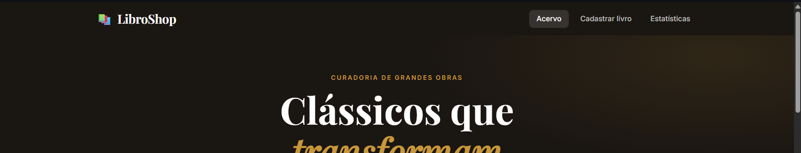
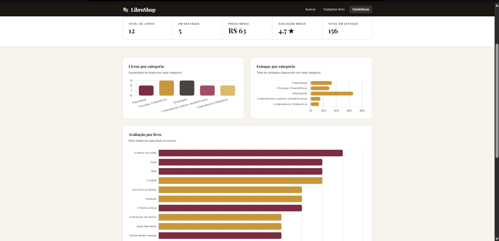
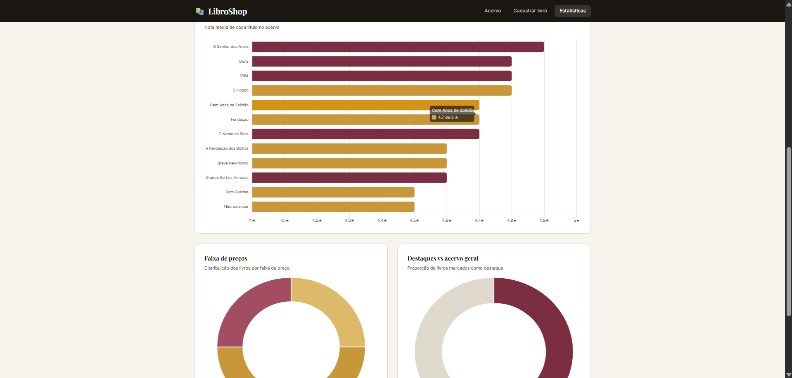
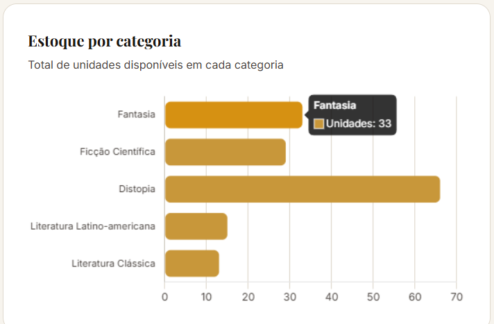

# Trabalho Prático - Semana 14

A partir dos dados que você tem no seu projeto, vamos trabalhar formas de apresentação que representem de forma clara e interativa essas informações. Você poderá usar gráficos (barra, linha, pizza), mapas, calendários ou outras formas de visualização. Seu desafio é entregar uma página Web que organize, processe e exiba os dados de forma compreensível e esteticamente agradável.

Com base nos tipos de projetos escohidos, você deve propor **visualizações que estimulem a interpretação, agrupamento e exibição criativa dos dados**, trabalhando tanto a lógica quanto o design da aplicação.

Sugerimos o uso das seguintes ferramentas acessíveis: [FullCalendar](https://fullcalendar.io/), [Chart.js](https://www.chartjs.org/), [Mapbox](https://docs.mapbox.com/api/), para citar algumas.

## Informações do trabalho

- Nome: Crispim Bruno Da Silva Junior
- Matricula: 923833
- Proposta de projeto escolhida: Chart.js
- Breve descrição sobre seu projeto:

o projeto como um todo é uma livraria online (LibroShop), onde o cliente pode selecionar, ver uma descrição, ver valores, é possível adicionar livros e agora, olhar as estatisticas gerais do site.

-aba de estatisticas no header-

Nessa etapa adicionei uma aba de estaticas que lê os dados do json e, com base nelas, gera um gráfico de valores. No caso foram 5 gráficos, 3 de linha e 2 de pizza, separdos por valor, genero, avaliação...

